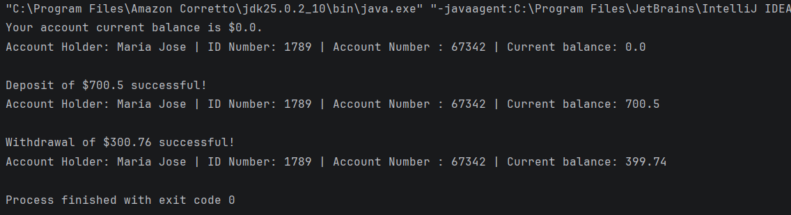

# 🏦 Java Bank Simulator

Este é um mini projeto desenvolvido para praticar os pilares da **Programação Orientada a Objetos (OOP)** em Java, focando em encapsulamento e composição de objetos.

## 🎯 Objetivos do Projeto
O objetivo principal foi simular o funcionamento de uma conta bancária simples, explorando como os objetos interagem na memória e como estruturar classes de forma escalável.

## 🛠️ Conceitos Aplicados
* **Classes e Objetos:** Criação de moldes (`Account`, `AccHolder`) e suas instâncias.
* **Composição:** A classe `Account` possui um objeto `AccHolder`, demonstrando o relacionamento "tem um".
* **Encapsulamento:** Uso de modificadores de acesso (`private`, `final`) para proteger os dados.
* **Gestão de Memória:** Estudo prático de como referências ficam na **Stack** e objetos na **Heap**.
* **Sobrescrita (Override):** Implementação do método `toString()` para representação textual dos objetos.

## 📂 Estrutura do Projeto
O projeto está organizado em pacotes para seguir as convenções de mercado:
- `com.jma.entities`: Contém as entidades core (`Account` e `AccHolder`).
- `com.jma.application`: Contém o simulador e o ponto de entrada (`main`).

## 🚀 Como Executar
1. Certifique-se de ter o **JDK 17 ou superior** instalado.
2. Clone o repositório:
   ```bash
   git clone git@github.com:joice-alves/bank-simulator-oop.git
3. Compile e execute a classe BankSimulator.java.

## 💻 Exemplo de Saída


#### ✨ Projeto desenvolvido para estudos de fundamentos de Java e Programação Orientada à Objetos.